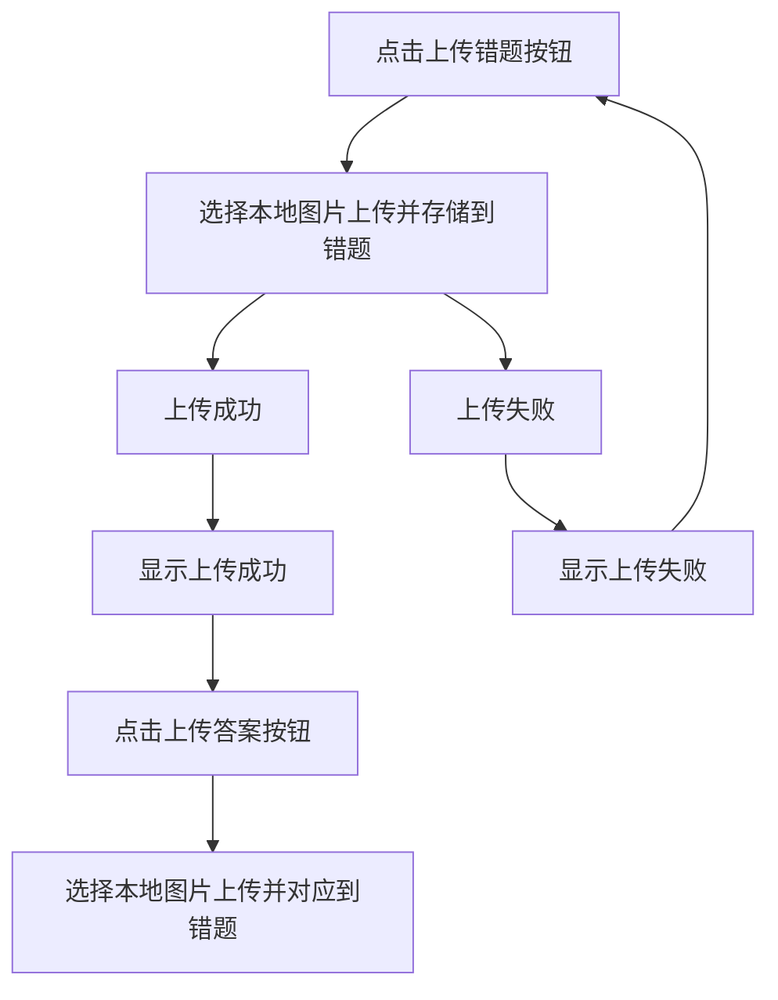

# 项目名：错题本网站

## 期望功能

1. 上传错题以及错题答案
2. 分类
3. 记录错题时间
4. 重做机制
5. 奖励机制

### 上传错题以及错题答案

1. 需要有历史上传过的错题库
2. 在网页中能够将错题库按时间、名称排序，并且可以通过拖动实现自定义排序
3. 错题与错题答案一一对应
4. 上传错题流程：

```mermaid
graph TD;
    点击上传错题按钮-->选择本地图片上传并存储到错题;
    选择本地图片上传并存储到错题-->上传成功
    上传成功-->显示上传成功;
    选择本地图片上传并存储到错题-->上传失败
    上传失败-->显示上传失败
    显示上传失败-->点击上传错题按钮
    显示上传成功-->点击上传答案按钮;
    点击上传答案按钮-->选择本地图片上传并对应到错题;
```